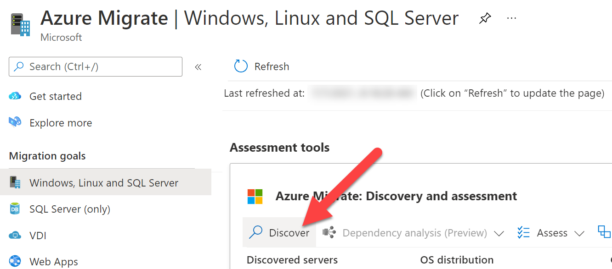
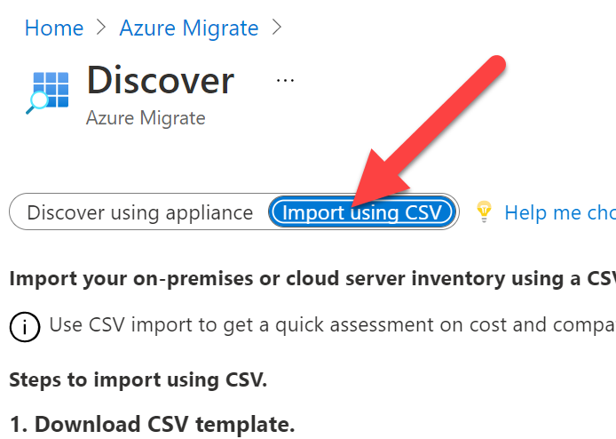

# The coach and attendee topic deck for Migration can be found at [aka.ms/OpenHackTopicDecks](https://aka.ms/OpenHackTopicDecks)

## Additional assistance

### Challenge #2: Assess workloads for migration

To help in the Discovery phase, if the system is having problems identifying source systems, these are a few things to check for:

* Ensure appliance has network connectivity to the server to be assessed.
* Ensure the appliance is showing up in the migration system. If the appliance does not show up in the Migration tool of the Assessment, ensure the appliance has run through the setup wizard and applied to the appliance.
* Also, check the [Troubleshoot discovery](https://docs.microsoft.com/en-us/azure/migrate/troubleshoot-discovery) site for additional methods if having isses

If all connectivity appears fine, but the system is still not discovering the on premise resources or it is taking too long, the systems can be imported using a CSV file using the below [**Azure Discovery Alternatives**](#azure-discovery-alternatives):

#### Azure Discovery Alternatives
  
The process of gathering information of operating system environments (OSE) and migrating data of VMs between environments due take some time due to the nature of transferring data.  However, there are a few steps that can be done to speed up and view how the system works.  These are a few options you can do.
  
##### Discover Import
  
If the system is not able to assess the environment or identify details, you can import an inventory of the environment, their configuration, and utilization with a CSV file.  You can download an example [CSV file here](https://go.microsoft.com/fwlink/?linkid=2109031). The properties in the CSV are:
  
* Server Name – name of the computer
* IP Addresses – Semi-colon separated list of IPv4 and IPv6 addresses used by the machine
* Cores – number of vCPU used
* Memory – Amount of memory in MB
* OS Details
    * Name – Type of operating system
    * Version – Version of the OS in use
    * Architecture – Architecture (like x64/x86)
* CPU Utilization – percentage of the CPU in use
* Memory Utilization – percentage spike of the CPU usage
* Network
    * Adapter count – number of NIC’s attached to the machine
    * Input Throughput – amount of throughput in Mbps into system
    * Output Throughput – amount of throughput in Mbps out of the system
* Boot Type – type of boot used by systems (UEFI/BIOS)
* Disks
    * Number of disks – number of disks attached to disk
    * Per disk size – size of disk in GB
    * Per disk reads (Bytes) – amount of MB per second read from each disk
    * Per disk writes (Bytes) – amount of MB per second written to each disk
    * Per disk reads (IOPS) – count of output operations from disk per second
    * Per disk writes (IOPS) – count of input operations from disk per second
  
Once the CSV is populated, you can then import the systems into the Migrate assessment phase by doing the following:

1. Go to the Azure Migrate, under Migration goals, click the appropriate resource type (ie: **Windows, Linux and SQL Server**)
1. Click the **Discover** link

    

1. Choose **Import using CSV** at the top

    

1. Upload the CSV file of your resources using the on screen instructions clicking **Import** to read the file.
